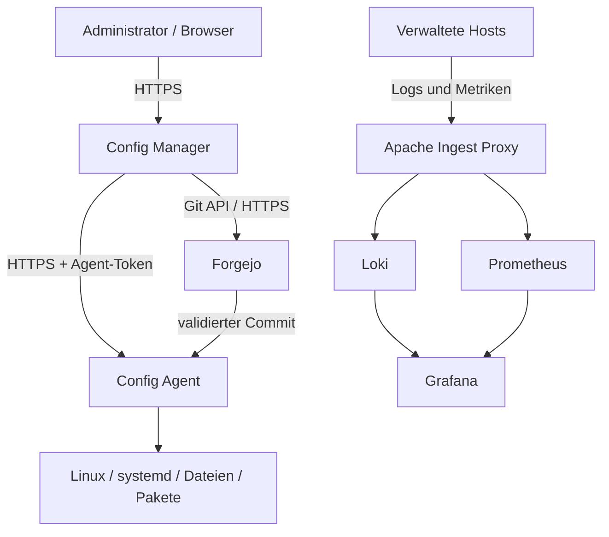

# Local Infrastructure Stack

Lokale Management-, Deployment- und Observability-Plattform fuer Linux-Systeme.

**Aktueller Stand:** `3.18.32`<br>
**Primaere Zielplattform:** openSUSE Leap / SUSE Linux Enterprise Server<br>
**Betriebsmodell:** lokale Control Plane, Git als Source of Truth und getrennte Observability Data Plane

Der Stack verbindet einen privilegierten Config-Agenten mit einem webbasierten
Config Manager, Forgejo, Git-basierten Deployments, Monit, Grafana Alloy, Loki,
Prometheus und Grafana. Firewall, Fail2ban, ModSecurity, Package Management und
Postfix koennen pro Zielserver verwaltet oder ueber definierte Deploy-Profile
ausgerollt werden.

> **Wichtig:** Die Plattform veraendert privilegierte Systemkonfigurationen.
> Vor einer produktiven Installation muessen Hostnamen, TLS, Netzwerk-ACLs,
> erlaubte Pfade, Service-Aktionen und Backup-/Rollback-Prozesse geprueft werden.

## Inhalt

- [Zielbild](#zielbild)
- [Funktionsumfang](#funktionsumfang)
- [Architektur](#architektur)
- [Komponenten und Versionen](#komponenten-und-versionen)
- [Voraussetzungen](#voraussetzungen)
- [Schnellstart](#schnellstart)
- [Konfiguration](#konfiguration)
- [Installation einzelner Komponenten](#installation-einzelner-komponenten)
- [Git Deploy und Ownership](#git-deploy-und-ownership)
- [Observability](#observability)
- [Security-Modell](#security-modell)
- [Betrieb und Healthchecks](#betrieb-und-healthchecks)
- [Backup und Restore](#backup-und-restore)
- [Tests und Qualitaet](#tests-und-qualitaet)
- [Troubleshooting](#troubleshooting)
- [Repository-Struktur](#repository-struktur)
- [Dokumentation](#dokumentation)
- [Lizenz und Drittanbieter](#lizenz-und-drittanbieter)

## Zielbild

Local Infrastructure Stack stellt eine lokale Verwaltungsplattform fuer
heterogene Linux-Server bereit. Die Loesung trennt bewusst:

1. **Control Plane:** Config Manager, Forgejo, Server Registry, Enrollment und
   Desired State.
2. **Client Baseline:** Config Agent, Host-Identitaet, Monit-Basiszugang und
   Grafana Alloy.
3. **Workloads:** Postfix, Rspamd, Redis, Webserver, eigene Anwendungen und ihre
   workload-spezifischen Konfigurationen.

Die Baseline bleibt klein. Softwarepakete und Workload-Konfigurationen werden
ueber Git, Deploy-Profile und ein internes Paket-Repository verteilt.

## Funktionsumfang

| Bereich | Funktionen |
| --- | --- |
| Config Manager | Webportal, Serverauswahl, Konfigurationseditor, Diff, Audit und Betriebsuebersicht |
| Config Agent | Geschuetzte Dateioperationen, Backups, Restore, Service-Aktionen und Hoststatus |
| Git Deploy | Preview, Commit-/Ref-Pruefung, Preflight, atomare Aktivierung, Historie und Rollback |
| Forgejo | Lokaler Git Source of Truth, private Repositories und kontrollierter Upload |
| Desired State | Gruppen-/Label-basierte Zuweisung von Managed Configs und Deploy-Profilen |
| Package Management | Inventar, Update-Erkennung, Paketaktionen und Fleet-Vergleich |
| Security Operations | Firewall, Fail2ban, ModSecurity/OWASP CRS und geschuetzter File Manager |
| Monitoring | Monit, Prometheus-Exporter, Service- und Endpoint-Checks |
| Observability | Alloy, Loki, Prometheus, Grafana und vorbereitete Dashboards |
| Enrollment | Aufnahme neuer Agenten, Host-ID, Gruppen, Labels und Token-Lifecycle |

## Architektur



### Sicherheitsgrenzen

- Das Webportal fuehrt keine frei formulierten Root-Kommandos aus.
- Der Config Agent ist die privilegierte Sicherheitsgrenze.
- API-Routen, Dateipfade und Service-Aktionen werden ueber Whitelists begrenzt.
- Managed Configs und Git Deploy besitzen getrennte `allowed_roots`.
- Schreibvorgaenge verwenden Locking, Backup und atomare Aktivierung.
- Interne Backend-Ports werden soweit moeglich nur an Loopback gebunden.
- Observability-Daten laufen nicht durch die PHP-Anwendung des Config Managers.

Ausfuehrliche Datenfluesse und Vertrauensgrenzen stehen in
[`docs/ARCHITECTURE.md`](docs/ARCHITECTURE.md).

## Komponenten und Versionen

Die kanonische Versionsquelle ist [`VERSIONS.json`](VERSIONS.json).

| Komponente | Version / Stand |
| --- | --- |
| Local Infrastructure Stack | `3.18.32` |
| Config Agent | `2.23.15` |
| Config Manager Standalone | `2.33.6` |
| Monit Prometheus Exporter | `1.1.0` |
| Client Baseline | `1.2.8` |
| Forgejo | `15 LTS`, rootless Podman-Container |
| Grafana | konfigurierbar, Default siehe `teko-stack.conf` |
| Loki | konfigurierbar, Default siehe `teko-stack.conf` |
| Prometheus | konfigurierbar, Default siehe `teko-stack.conf` |

`bin/sync-versions.py` synchronisiert die abgeleiteten Versionsdateien aus
`VERSIONS.json`.

## Voraussetzungen

### Zielsystem

- openSUSE Leap 15.6/15.7 oder kompatibles SLES-System
- Root-/sudo-Zugriff fuer Installation und Systemintegration
- systemd und zypper
- funktionierende lokale Namensaufloesung oder DNS
- Zeit-Synchronisation
- ausreichend Speicher fuer Container, Logs, Metriken und Git-Repositories

### Typische Abhaengigkeiten

- Bash, Git, curl, rsync und OpenSSL
- Python 3
- Perl und Mojolicious
- Apache 2
- PHP 8 mit `curl`, `sqlite`, `openssl`, `ctype` und `mbstring`
- Podman
- Monit und Postfix, falls die entsprechenden Komponenten verwendet werden
- Go 1.22 nur fuer einen lokalen Neubuild des Monit Exporters

Die Installationsskripte installieren vorgesehene Pakete auf der Zielplattform
soweit moeglich selbst. Details stehen in
[`docs/INSTALLATION.md`](docs/INSTALLATION.md).

## Schnellstart

### 1. Repository klonen

```bash
git clone <repository-url> local-infrastructure-stack
cd local-infrastructure-stack
```

### 2. Repository pruefen

```bash
./tools/repo-check.sh
./tools/run-all-tests.sh
```

Der Volltest erzeugt seinen JSON-Bericht unter `reports/TEST_RESULTS.json`.
Das Verzeichnis ist absichtlich von Git ausgeschlossen.

### 3. Namensmodell festlegen

Interaktiv:

```bash
sudo ./setup_teko_local.sh --configure-names
```

Mit Paketdefaults:

```bash
sudo ./setup_teko_local.sh --default-names
```

Mit expliziter Server-IP:

```bash
sudo SERVER_IP=192.168.121.20 ./setup_teko_local.sh
```

Ohne explizite Angabe wird die IPv4-Adresse der Default-Route ermittelt.

### 4. Vollinstallation

```bash
sudo ./setup_teko_local.sh
```

Ein kontrollierter Redeploy kann mit `--force` erfolgen:

```bash
sudo ./setup_teko_local.sh --force
```

Vor einem Force-Lauf muessen lokale Abweichungen gesichert oder in den Source
of Truth uebernommen werden.

### 5. Nachkontrolle

```bash
sudo ./bin/teko-health.sh
sudo ./bin/teko-postinstall-test.sh
systemctl --failed
```

## Konfiguration

### Zentrale Stack-Konfiguration

[`teko-stack.conf`](teko-stack.conf) enthaelt die Defaults fuer:

- Servername und FQDN
- Forgejo-Organisation, Repository und Servicekonto
- Config-Manager- und Config-Agent-Endpunkte
- internes Baseline-Paket-Repository
- PHP-Uploadgrenzen
- Grafana-, Loki- und Prometheus-Ports und Container-Images

Persistente standortspezifische Werte werden standardmaessig aus
`/etc/local-infrastructure-stack.conf` geladen. Environment-Variablen beim
Setup haben Vorrang.

### Standard-Namensmodell

| Dienst | Default |
| --- | --- |
| Server | `teko.local` |
| Forgejo | `git.local` |
| Config Manager | `config-manager.local` |
| Grafana | `grafana.local` |
| Forgejo-Organisation | `teko` |
| Config-Deploy-Repository | `config-deploy` |

Diese Werte sind Lab-/Paketdefaults und muessen fuer eine produktive Umgebung
an das eigene DNS- und Zertifikatsmodell angepasst werden.

### Relevante Ports

| Port | Dienst | Default-Bindung / Zweck |
| ---: | --- | --- |
| 443/tcp | Apache HTTPS | Browserzugriff und Observability-Ingest |
| 2222/tcp | Forgejo SSH | Git ueber SSH |
| 3000/tcp | Forgejo HTTP | intern, standardmaessig Loopback |
| 3001/tcp | Grafana | intern, standardmaessig Loopback |
| 3100/tcp | Loki | intern, standardmaessig Loopback |
| 5008/tcp | Config Agent | standardmaessig Loopback bzw. gezielte ACL |
| 9090/tcp | Prometheus | intern, standardmaessig Loopback |
| 9108/tcp | Monit Exporter | intern, standardmaessig Loopback |

Nicht benoetigte Ports duerfen nicht extern freigegeben werden.

### Beispielkonfigurationen

Produktive Runtime-Dateien werden nicht aus dem Source-Tree verwendet. Die
Beispiele befinden sich unter:

- `config-agent/example/`
- `config-manager-standalone/config/*.example.json`
- `config-manager-standalone/standalone/data/*.example`
- `observability/**/**.example`

Weitere Parameter beschreibt
[`docs/CONFIGURATION.md`](docs/CONFIGURATION.md).

## Installation einzelner Komponenten

Die Komponenten koennen unabhaengig installiert oder repariert werden.

```bash
# Forgejo
sudo ./teko-forgejo-local/setup_forgejo_teko.sh

# Config Agent
sudo ./setup_config_agent.sh ./config-agent

# Config Manager
sudo ./setup_config_manager.sh \
  ./config-manager-standalone \
  /srv/www/config-manager-standalone

# Agent Enrollment Manager
sudo ./setup_agent_enrollment_manager.sh

# Internes Baseline-Paket-Repository
sudo ./setup_baseline_repository.sh

# Observability
sudo ./setup_observability.sh

# Postfix und Monit
sudo ./setup_postfix_monit.sh

# Monit Prometheus Exporter
sudo ./setup_monit_exporter.sh
```

Alle Installationsskripte sind wiederholbar ausgelegt. Ein Abbruch muss vor der
Wiederholung fachlich bewertet werden; `--force` ist kein Ersatz fuer eine
Fehleranalyse.

## Git Deploy und Ownership

### Deployment-Ablauf

1. Repository und Ref aus dem Deploy-Profil aufloesen.
2. Ziel-Commit nach der definierten Ref-Regel pruefen.
3. Dateien in ein sicheres Release-Verzeichnis laden.
4. Anzahl, Groesse, Pfade, Symlinks, LFS und Submodule validieren.
5. Preserve-Regeln und Preflight-Pruefungen anwenden.
6. Release atomar aktivieren.
7. Commit-Marker, Historie und Rollback-Daten schreiben.

Unterstuetzte Aktivierungsmodelle sind `directory_swap` und
`symlink_release`. Details stehen in
[`docs/GIT_DEPLOY.md`](docs/GIT_DEPLOY.md).

### Konfigurations-Ownership

Jede Datei soll genau einen primaeren Besitzer haben:

| Owner | Verantwortungsbereich |
| --- | --- |
| Client Baseline | Config Agent, Host-ID, Monit-Basiszugang und Alloy-Basiskonfiguration |
| Forgejo / Git | dauerhafte Workload-Konfigurationen, Skripte und Rollenprofile |
| Managed Configs | registrierte Einzeldateien ohne Git-Ownership |
| File Manager | Expert-/Break-Glass-Aenderungen mit bewusstem Override |
| Security-/Operations-GUIs | Firewall-, Fail2ban-, ModSecurity- und Paketstatus |

Direkte lokale Aenderungen an Git- oder Baseline-verwalteten Dateien koennen
beim naechsten Deployment ueberschrieben werden.

## Observability

### Datenfluss

- Grafana Alloy sammelt Journal-Logs und Basis-Metriken auf verwalteten Hosts.
- Apache terminiert TLS und authentisiert den host-spezifischen Token.
- Loki nimmt Logs entgegen.
- Prometheus nimmt Metriken entgegen.
- Grafana visualisiert beide Datenquellen.
- Monit ueberwacht lokale Dienste und Endpunkte.
- Der Go-Exporter uebersetzt Monit XML nach Prometheus-Metriken.

Die Control Plane transportiert keine kontinuierlichen Telemetrie-Payloads.
Loki und Prometheus bleiben auf dem Management-Server standardmaessig lokal
gebunden.

### Client-Baseline-Deployment

Die Software-Baseline wird ueber das Forgejo-Repository
`teko/observability-client` und das Deploy-Profil `observability-client`
verteilt. Der Paketplan umfasst:

- `monit`
- `alloy`
- `monit-prometheus-exporter`
- `client-baseline`

Das interne RPM-Repository kann offline unter
`baseline-repository/packages/` vorbereitet werden. Auf dem Management-Server
wird standardmaessig `file:///srv/www/baseline-repo/` verwendet; verwaltete
Hosts greifen ueber den konfigurierten HTTPS-Endpunkt zu.

## Security-Modell

### Grundregeln

1. Config-Agent-Authentisierung nicht deaktivieren.
2. `path_guard=enforce` beibehalten.
3. `allowed_roots` minimal halten.
4. `git_deploy.allowed_roots` getrennt pflegen.
5. Keine produktiven Secrets in Git speichern.
6. Interne Listener nur gezielt exponieren.
7. Fuer Remote-Zugriff TLS und Netzwerk-ACLs verwenden.
8. Nur definierte Service-Aktionen erlauben.
9. Keine freien Shell-Kommandos aus Webrequests ausfuehren.
10. Vor Aktivierung Preflight- und Syntaxpruefungen ausfuehren.

### Secrets

Produktive Zugangsdaten liegen ausserhalb des Repositories, beispielsweise:

```text
/opt/service/env/config-agent.env
/opt/service/env/forgejo-api.token
/opt/service/env/forgejo-admin.env
/opt/service/env/config-manager-admin.env
```

Die Dateien muessen `root` gehoeren und mit restriktiven Rechten, typischerweise
`0600`, gespeichert werden. Im Repository sind nur `.example`-Dateien mit
Platzhaltern erlaubt.

Die Abschlussausgabe zeigt Secrets standardmaessig nicht an. Fuer einen
bewussten lokalen Abruf existiert:

```bash
sudo ./setup_teko_local.sh --show-secrets
```

Die Ausgabe darf nicht in Tickets, Chatverlaeufe oder CI-Logs kopiert werden.

### TLS

Selbstsignierte Zertifikate sind nur fuer isolierte Lab-Umgebungen vorgesehen.
Produktiv sollen Zertifikate einer internen CA verwendet und die
TLS-Verifikation aktiviert werden.

Weitere Hinweise stehen in [`SECURITY.md`](SECURITY.md).

## Betrieb und Healthchecks

### Plattformstatus

```bash
sudo ./bin/teko-health.sh
sudo ./bin/teko-postinstall-test.sh
systemctl --failed
```

### Wichtige Services

```bash
systemctl status apache2 forgejo.service config-agent.service --no-pager
systemctl status grafana.service loki.service --no-pager
systemctl status monit.service monit-prometheus-exporter.service --no-pager
```

### Journals

```bash
journalctl -u config-agent.service -n 100 --no-pager
journalctl -u forgejo.service -n 100 --no-pager
journalctl -u alloy.service -n 100 --no-pager
journalctl -u monit-prometheus-exporter.service -n 100 --no-pager
```

### Endpunkte

```bash
curl -kfsS https://config-manager.local/
curl -kfsS https://git.local/
curl -fsS http://127.0.0.1:9108/healthz
curl -fsS http://127.0.0.1:9108/metrics | head
```

Ausfuehrliche Betriebsbefehle stehen in
[`docs/OPERATIONS.md`](docs/OPERATIONS.md).

## Backup und Restore

### Source of Truth

Zu sichern sind mindestens:

- Forgejo-Daten und Repositories
- Config-Manager-Runtime-Daten
- Agent-Registry und Host-Identitaeten
- produktive Environment-/Token-Dateien
- Zertifikate und CA-Vertrauen
- Observability-Konfiguration und persistente Daten nach Betriebsanforderung
- interne RPM-Artefakte, sofern sie nicht reproduzierbar bezogen werden koennen

### Nicht ins Git gehoert

- produktive Secrets und Tokens
- Audit-Datenbanken
- Runtime-Backups
- generierte Testreports
- Cache- und Bytecode-Dateien
- lokale IDE- oder Betriebssystemartefakte

### Restore

Ein Restore muss nicht nur Dateien, sondern auch Owner, Gruppe, Modus,
systemd-Units, Containerzustand und Token-Beziehungen wiederherstellen. Der
Forgejo-Backup-Ablauf befindet sich unter
`teko-forgejo-local/bin/forgejo-backup.sh`.

## Tests und Qualitaet

### Repository-Check

```bash
./tools/repo-check.sh
```

Geprueft werden unter anderem:

- Cache-, Bytecode- und Editor-Artefakte
- historische oder generierte Root-Reports
- produktive Secret-Dateien
- kanonische Beispielkonfigurationen
- JSON-, Shell-, Python- und PHP-Syntax
- Git-Whitespace

### Vollstaendige Regressionstests

```bash
./tools/run-all-tests.sh
```

Der Runner erkennt fehlende optionale Interpreter und markiert betroffene
Direkttests als `SKIP`. Fuer eine vollstaendige Freigabe muessen Bash, Python,
Node.js und PHP CLI inklusive der benoetigten Module installiert sein.

### Zielsystemtests

```bash
sudo ./bin/teko-health.sh
sudo ./bin/teko-postinstall-test.sh
```

Nur ein Zielsystemtest kann systemd, Podman, Apache, Postfix, Monit, Firewall,
Netzwerkpfade und Distributionseigenheiten vollstaendig bewerten.

Weitere Informationen: [`docs/TESTING.md`](docs/TESTING.md).

## Troubleshooting

### Setup-Skript startet nicht

```bash
chmod +x setup_*.sh tools/*.sh bin/*.sh
```

In einem regulaeren Git-Checkout sind die Execute-Bits bereits versioniert.

### Config Agent liefert HTTP 401 oder 403

- Token-Datei und Environment-Variable vergleichen.
- Mindestlaenge und Platzhalterpruefung beachten.
- `allowed_ips`, Token-Scopes und Listener-Bindung pruefen.
- TLS-Hostname und CA-Vertrauen kontrollieren.

### Monit Exporter liefert 401

- Pruefen, ob Monit HTTP/XML genau einmal konfiguriert ist.
- Gemeinsames Monit-Credential zwischen Baseline und Exporter pruefen.
- `monit -t` ausfuehren.
- Lokalen XML-Endpunkt separat testen.

### Alloy startet nicht

```bash
systemctl status alloy.service --no-pager
journalctl -u alloy.service -n 100 --no-pager
namei -l /etc/alloy/config.alloy
```

Datei und uebergeordnete Verzeichnisse muessen fuer den effektiven
Alloy-Serviceuser lesbar sein. Zugangsdaten gehoeren in die geschuetzte
Environment-Datei, nicht in `config.alloy`.

### Git Deploy bricht beim Preflight ab

- Zielpfad gegen `git_deploy.allowed_roots` pruefen.
- Repository-URL, Ref und Commit-Regel pruefen.
- Preflight-Ausgabe und Aktivierungshistorie lesen.
- Keine Symlinks, Submodule oder LFS-Zeiger ausserhalb des erlaubten Modells
  verwenden.

### Firewall-Seite wirkt langsam

`firewalld`-/D-Bus-Abfragen koennen je nach Host ungefaehr eine Sekunde pro
Aufruf benoetigen. Zuerst den lokalen Agent-Endpunkt und danach den Browserpfad
getrennt messen.

## Repository-Struktur

```text
.
├── baseline-repository/          RPM-Spezifikationen und Offline-Repository
├── bin/                          Betriebs-, Bootstrap- und Synchronisationswerkzeuge
├── config-agent/                 privilegierter lokaler Agent
├── config-manager-standalone/    Webportal und Backend
├── docs/                         Architektur-, Installations- und Betriebsdokumentation
├── monit-exporter/               Go-Exporter inklusive Quellcode und Release-Binary
├── observability/                Loki-, Prometheus- und Grafana-Konfiguration
├── teko-forgejo-local/           Forgejo-Setup, Betrieb und Backup
├── tests/                        Plattform- und Regressionstests
├── tools/                        Repository-Check und Test-Runner
├── setup_*.sh                    Installationsskripte der Komponenten
├── teko-stack.conf               zentrale Stack-Defaults
├── VERSIONS.json                 kanonische Versionsquelle
└── README.md                     Einstieg und Betriebsuebersicht
```

## Dokumentation

| Dokument | Inhalt |
| --- | --- |
| [`docs/ARCHITECTURE.md`](docs/ARCHITECTURE.md) | Zielbild, Datenfluesse, Vertrauensgrenzen und Ownership |
| [`docs/INSTALLATION.md`](docs/INSTALLATION.md) | Voraussetzungen, Installation und Nachkontrolle |
| [`docs/CONFIGURATION.md`](docs/CONFIGURATION.md) | Agent-, Manager- und Deploy-Konfiguration |
| [`docs/GIT_DEPLOY.md`](docs/GIT_DEPLOY.md) | Deployment-Modi, Commit-Regeln, Preflight und Rollback |
| [`docs/GIT_WORKFLOW.md`](docs/GIT_WORKFLOW.md) | Branches, Commits, Tags und Push-Pruefungen |
| [`docs/OPERATIONS.md`](docs/OPERATIONS.md) | Standardbetrieb und Diagnose |
| [`docs/TESTING.md`](docs/TESTING.md) | Testebenen und Zielsystemtests |
| [`docs/REPOSITORY_POLICY.md`](docs/REPOSITORY_POLICY.md) | Repository-Hygiene und Runtime-Trennung |
| [`SECURITY.md`](SECURITY.md) | Sicherheitsmodell und Meldung von Schwachstellen |
| [`CHANGELOG.md`](CHANGELOG.md) | technische Aenderungshistorie |
| [`RELEASE_NOTES.md`](RELEASE_NOTES.md) | Releasebezogene Hinweise |

## Mitwirken

Vor jedem Commit:

```bash
./tools/repo-check.sh
./tools/run-all-tests.sh
git diff --check
```

Beitraege sollen eine fachliche Aenderung pro Commit enthalten und passende
Regressionstests mitbringen. Details stehen in
[`CONTRIBUTING.md`](CONTRIBUTING.md).

## Lizenz und Drittanbieter

Fuer den projektspezifischen Code wird ohne separate schriftliche Lizenz keine
Nutzungslizenz erteilt; siehe [`LICENSE`](LICENSE). Vor einer gewollten
Open-Source-Veroeffentlichung muss der Repository-Eigentuemer bewusst eine
passende Lizenz festlegen.

Hinweise zu eingebetteten Drittanbieter-Komponenten stehen in
[`THIRD_PARTY_NOTICES.md`](THIRD_PARTY_NOTICES.md).
